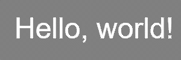

+++
title = "`text-shadow` and accessibility checking"
description = "How current accessibility checking tools deal with `text-shadow` when assessing contrast, with concrete and demonstrated ideas for improvement"
date = 2025-07-03

[taxonomies]
tags = ["web", "a11y"]

[extra]
comment = "versions: firefox 140.0.2, lighthouse 12.6.0"
+++

Current accessibility tools have significant gaps in how they handle [`text-shadow`](https://developer.mozilla.org/en-US/docs/Web/CSS/text-shadow) when checking contrast. Some ignore shadows entirely, others handle them well in simple cases but give up when backgrounds get complex. This post explores the issues involved, outlines two broad approaches taken by current tools, and demonstrates potential improvements to both with a working proof-of-concept. There's no silver bullet -- it's an inherently messy problem -- but incremental progress is possible.

It's amazing how effective yak-shaving can be for leading you to ~~absurdly niche~~ under-explored areas. At the time of writing, the top right of this blog's header showed the blog name in white letters overlaid on a background image including both landscape (dark-to-medium brightness) and sky (light). Since white-on-light isn't great for contrast, I'd added a text shadow effect providing a darker halo around the letters. I didn't think much more about it until I ran the accessibility checker built into Firefox's excellent developer tools, which delivered the damning verdict *"Does not meet WCAG standards for accessible text"*, with a best-case colour swatch strongly suggesting that the tool wasn't paying any attention at all to the shadow specifically intended to improve contrast. [Lighthouse](https://en.wikipedia.org/wiki/Lighthouse_\(software\)) (the corresponding tool in Chromium-based browsers) raised no such objection, but continued to raise no objection even without the shadow, which cast some doubts upon its rigour. Oh well, just one of those trifling disappointments which build character, and certainly nothing to warrant an obsessive overreac--


We'll start with general background, then survey some of the perceptual considerations that make this area such a challenge to model. From there we'll get into the technical weeds, exploring the analytic and image-based approaches used by Lighthouse and Firefox respectively, and describing ideas implemented in the working proof-of-concept. These sections include some code, but it's not essential for understanding the core ideas.

## Background

Accessibility checkers are tools designed to help developers make their UIs as usable as possible for people with various disabilities, including difficulties distinguishing differences in brightness and colour. The Firefox accessibility tool has a nifty "Simulate" tool where you can get a sense of what this looks like in practice; it can also run an audit of your page to try to catch some common issues, like the one that prompted this post. This was
WCAG's [Contrast (Minimum)](https://w3c.github.io/wcag/guidelines/22/#contrast-minimum) rule, which wants a contrast of at least 4.5:1 for normal text or 3:1 for large text.


That would be a stretch; the text serves as a hyperlink to the blog's homepage, so it's not purely decorative. More to the point, there's no way to mark an element as "part of a logo or brand name", which makes the question kind of moot. 


The WCAG rule is notably vague on what's being contrasted with what. Normally it'll just be text colour against background colour, which is easy to validate, but there are also more complicated possibilities:

- The background is an image or gradient rather than a flat colour
- The text has a CSS [`text-shadow`](https://developer.mozilla.org/en-US/docs/Web/CSS/text-shadow) effect applied, often specifically to improve contrast
- The text has an outline in a different colour, drawn with the new and still vendor-prefixed but nevertheless widely-supported CSS [`-webkit-text-stroke`](https://developer.mozilla.org/en-US/docs/Web/CSS/-webkit-text-stroke) property
- The text is shown superimposed over some arbitrary other content, e.g. using `position: absolute` or just poorly-managed overflow

This post is mainly interested in the second of these, but they're all worth keeping in mind and will come up again. One complication I'm not going to cover here is partially-transparent text colour; mildly interesting, but it's straightforwardly bad for contrast and doesn't have a lot in common with our main focus. I'm also not considering the important caveat that layout shifts might move text onto a different background; as far as I know, all checkers only consider a snapshot of layout and can't simulate possible changes to it.


CSS has a recent `@media` feature called [`prefers-contrast`](https://developer.mozilla.org/en-US/docs/Web/CSS/@media/prefers-contrast), which allows stylesheet authors to enable special rules for users who need more contrast. In the case of our header, we could do something like slapping a big black box under the link text:

```css
@media (prefers-contrast: more) { /* replace with no-preference to test */
    header a { background-color: #000a; box-shadow: 0 0 0.5em #000a; }
}
```

With a rule like that in effect, checkers are happy. Unfortunately, in the normal course of things, checkers don't simulate this preference being enabled when assessing contrast. There's an argument to be made that they *should*, and there's a [Bugzilla ticket](https://bugzilla.mozilla.org/show_bug.cgi?id=1934406) you can follow if you agree. I'm ambivalent; the rationale makes sense, but I can also imagine cases where the user doesn't know about the preference, or is using someone else's computer where they don't feel comfortable messing with settings, or a browser running in kiosk mode where the settings aren't physically accessible.


## Perceptual considerations

The `text-shadow` property description is deceptively simple. There are only really three knobs to twiddle: the colour of the shadow, the offset of the shadow from the text generating it, and the blur radius (formally related to the size of the convolution matrix used by the effect's [Gaussian blur](https://en.wikipedia.org/wiki/Gaussian_blur); informally, how much the shadow is diffuse rather than hard-edged). There's also a fourth factor, which is that multiple shadows can be declared in the same CSS rule, potentially with different colour/offset/radius settings.

The interaction of these factors, though, makes the impact of shadows on legibility a non-trivial thing to model. Not [`font-size` levels of nontrivial](https://manishearth.github.io/blog/2017/08/10/font-size-an-unexpectedly-complex-css-property/) by any means, but nontrivial.

Colour is the simplest. Text shadows tend to be weak at best, so I'm not considering fractional alpha. However, don't assume that a shadow necessarily *helps* contrast. When the "shadow" colour is closer to the foreground than the background, like a glow effect to make light text appear even brighter, it effectively blurs the edges making it less readable:

[](https://mrec.github.io/webtoys/masked_contrast/#!d4gnr)

Offset is technically two offsets, `x` and `y`. For shadows aiming to enhance contrast it'll usually make sense to offset on both axes; a vertical-only offset won't do much to enhance the legibility of a sans-serif 'I', or a horizontal-only one of an em dash. A zero offset in the absence of any blur means the shadow will be invisible behind its text, making it useless. Excessive offsets hurt legibility more than they help; in extreme cases they may not even be onscreen, but even slightly too high and they can start to separate shadows from their parent glyphs or overlap neigbouring glyphs.

[](https://mrec.github.io/webtoys/masked_contrast/#!d1exn)

Blur radius is the only optional part of the property, defaulting to zero. (This may just reflect the fact that Gaussian blurs are relatively expensive operations, not feasible on old or low-end hardware.) Small radii give a more tightly-defined shadow but may be so thin as to be imperceptible; with no offset, most of the glyph pixels covered by the blur kernel just end up contributing shadow to pixels hidden under the same glyph. Larger radii give a larger halo, but at the cost of diluting the shadow contribution and so providing weaker contrast.


[](https://mrec.github.io/webtoys/masked_contrast/#!d1ent)
[](https://mrec.github.io/webtoys/masked_contrast/#!d1enx)

Slightly surprisingly, a small offset on its own can be perceptually just as effective as a small blur on its own, despite only providing contrast along one side of a glyph. I think this is because it's a stronger contrast, with alpha undiluted by blurring, and because essentially all writing systems are fundamentally made up of lines. (Braille is the only major exception, and not relevant to a discussion of visual contrast.) Solid glyph shapes are just embellishments; it's less important to see all the edges of a shape faintly than to see all the core lines clearly. There are pitfalls here, though: any single offset direction is likely to leave some lines without contrast; for a typical diagonal offset, half of 'x' is likely to suffer. And to be clear, this is not *good* contrast! It's just better than nothing, and ought to be recognized as such.

[](https://mrec.github.io/webtoys/masked_contrast/#!d1etn)

With both offset and blur combined, the perceptual sweet spot seems to be to have the centre of each shadow line, the most opaque part, displaced to the edge of its glyph line, while blur is just sufficient to provide some contrast to the other side of the stem without diluting the shadow too much.

[](https://mrec.github.io/webtoys/masked_contrast/#!d2etr)

The most common use of multiple shadows is to stack the same definition several times, to support a larger blur while still accumulating enough alpha to be effective. I'm assuming this for the sake of simplicity. Other more artistic patterns are possible, but rare. Lighthouse considers one interesting case, that of multiple thin (tiny offset, little or no blur) shadows stacked at slightly different offsets to approximate the effect of an outline stroke. This may have been common practice before blurs were widely supported, but these days a few clone shadows stacked with tiny blur and no offset can produce a similar but smoother effect, or for larger font sizes the new `-webkit-text-stroke` can support the desired text stroke directly.

[](https://mrec.github.io/webtoys/masked_contrast/#!d4ens)


One thought that kept recurring toward the end of writing this post is that "foreground versus background" can be a rather arbitrary distinction. Note 5 under [WCAG21's contrast definition](https://www.w3.org/TR/WCAG21/#dfn-contrast-ratio) is a prime example:

> When there is a border around the letter, the border can add contrast and would be used in calculating the contrast between the letter and its background. A narrow border around the letter would be used as the letter. A wide border around the letter that fills in the inner details of the letters acts as a halo and would be considered background.

As we've come to expect there's no clear definition of "narrow" or "wide", but the more pernicious bit here is *"\[a] narrow border around the letter would be used as the letter"*. This is talking about `-webkit-text-stroke` or thin-shadow approximations thereof, and I think it's misleading because it misses how these enhancements work. They're effective because with a thinly-stroked outline, both the stroke colour *and* the fill colour can provide useful contrast. If I have white text over a mostly dark background, it doesn't suddenly become unreadable when I add a black stroke. That just offers a fallback route to contrast in case patches of the background are lighter. In this case I think the analysis should calculate all three contrasts in play -- stroke/background, fill/background, and stroke/fill -- and use the best of them.

Another example: text softened by a `filter: blur` would generally be considered to be all foreground, whereas a stacked text shadow in the text colour is considered background, despite the two routes potentially rendering the exact same final pixels.



The ubiquity of multiple stacked copies as the solution to overly watery `text-shadow`s has become something of a pet peeve over the course of looking into this topic. As mentioned before, a Gaussian blur is *expensive*, and multiple identical blurs multiply that expense. It would seem to make far more sense to support a simple saturating alpha multiplier that could achieve the same result with only a single blur and a fraction of the cost.

This is something that a Sufficiently Smart Browser could theoretically optimize behind the scenes, but I don't know if any do. And the intent of an explicit multiplier would be far clearer in the CSS than reading a half-dozen shadow definitions and checking that they're all the same.


## Moving on to implementation

So if those are some of the major considerations, how might we deal with them? There are two main paths: the analytic approach, which only looks at the styled (`getComputedStyle()`) DOM tree, and the image-based approach, which looks at the actual pixels getting rendered. Both Firefox and Lighthouse do the former in simple cases, with Lighthouse taking it further in the specific `text-shadow` case. To the best of my knowledge, only Firefox does image-based assessment; I'm not sure that Lighthouse's architecture would even allow it, since it's less tightly coupled with the browser.

This post was written side by side with a basic proof-of-concept demo, which you can see [here](https://mrec.github.io/webtoys/masked_contrast/#!d4enrn). It's a self-contained single-file applet with no build pipeline, so View Source will show all the sausages being made should you feel so inclined. The various "Hello, world!" example images above and below link to this demo prepopulated with the parameters used to create them; you can tweak parameters to compare my (necessarily subjective) perceptual judgements with your own, or run your browser's accessibility checker against them in the DOM draw method mode to see what they make of it. 

Caveat: the image-based analysis in Canvas draw mode won't work in current Safari because it doesn't support `filter`, and I haven't tested on mobile. The overlays (e.g. outline mask or heatmap) shown in some images aren't part of persistent page state and so can't be set by the links; they're triggered by holding down one of the labelled buttons.

## Lighthouse and the analytic approach

When I first noticed that Lighthouse didn't object to my header, I decided that it was a splendid tool. When I subsequently found that Lighthouse just gives up on assessing any element with a `background-image`, I decided that it was a terrible tool. When I found out even later that without a `background-image` Lighthouse goes to considerable lengths to account for `text-shadow`, I decided that maybe I have an unhealthy habit of jumping to conclusions.

Lighthouse considers the presence of a shadow, its colour, blur radius and offset. I don't necessarily agree with all its choices, but it's a serious effort. If you want to dig into the implementation, most of it is in [`axe-core`'s get-text-shadow-colors.js](https://github.com/dequelabs/axe-core/blob/develop/lib/commons/color/get-text-shadow-colors.js) and [get-stroke-colors-from-shadows.js](https://github.com/dequelabs/axe-core/blob/develop/lib/commons/color/get-stroke-colors-from-shadows.js) under the MPL 2.0 license. My main reservation is that its internals lean too heavily on binary thresholds rather than continuous functions. I'm not (just) talking about the binary pass/fail exposed through Lighthouse, it's full of internal rules like "if offset is more than blur radius then ignore the shadow, but if it's even a smidge under then it's fine". I've noticed several cases where I think Lighthouse passes things it shouldn't, e.g. [weak narrow blurs](https://mrec.github.io/webtoys/masked_contrast/#!d1entn), but it's not really fair to pick on those too much. I very much doubt that any solution will be free of warts. At least some of my decision to try reinventing the wheel here was just that it's an interesting problem; as such, given that Lighthouse's existence has already demonstrated that an analytic approach is at least somewhat feasible, you're obviously free to skip ahead to the next section.


For some reason, when foreground and background colours are exactly the same, Lighthouse reports that accessibility is absolutely fine. This is regardless of any shadow. At first I thought it was hitting some sort of divide-by-zero internally and falling over, but it might also be a deliberate rule to handle an old webdev pattern which used this trick to hide content from most users while still showing it to screen readers.

Either way, it's a little disconcerting. It's the sort of mistake that could genuinely happen if you were converting a light-mode stylesheet to dark mode and missed something. It can also give you misleading ideas about Lighthouse's analysis; the white foreground/background, black shadow combination was an obvious experiment to try when testing its shadow handling.


I was curious to see where starting from first principles would get me, and eventually boiled the perceptual considerations listed earlier down into two main factors: **exposure** and **dilution**.

**Exposure** estimates how much of a shadow ends up somewhere useful; neither hidden under a glyph nor too far away from it to be effective. Exposure can be increased up to a point by either offset (moving the shadow out from under), blur (spreading the shadow out from under) or a combination of the two. In both cases the sweet spot is largely driven by the font's stem width, the thickness of each line making up a glyph. This isn't something that font metrics expose, so I'm estimating it to be roughly a tenth of the font size; the real number will vary by resolved `font-family` and in a serious implementation should be adjusted for `font-weight`. From experimentation, going over the sweet spot hurts legibility more than being under it, so exposure calculations use an opinionated helper function that applies exponential penalties over the ideal level:

```js
function opinionatedExposure(stemWidth, raw, ideal, excessExponent) {
    let norm = raw / stemWidth;
    let exposure = norm / ideal;
    if (exposure > 1) exposure /= (exposure ** excessExponent);
    return exposure;
}
```

**Dilution** estimates how much a shadow's opacity is reduced by blur. This turned out to be a nasty, nasty problem. A simple closed-form equation based on radius penalizes large blurs too much; perceptually, we're mostly interested in the peak opacity at a glyph edge. Lower opacity further out might not help, but it doesn't actively hurt. A weighted 1D Gaussian approximation dramatically underestimates opacity, because the shadow blur we're doing is 2D, meaning far more input pixels contribute to the output, in glyph-area-dependent ways. Looking at 2D Gaussians led me to things like Abramowitz and Stegun's fast erf approximation, which is so far outside my mathematically-challenged comfort zone that I couldn't see my mathematically-challenged sofa with a telescope. 

At this point I stepped back, took some empirical measurements of edge shadow opacity at various blurs, and fitted them to a curve; we're never going to do better than an approximation here, and ultimately pragmatism won out. (Lighthouse does the same kind of thing, which makes me feel a bit better.)

```js
function fittedAlpha(blur) {
    return 1 / (1 + 9.035 * (blur / fontSize) ** 2);
}
```

With both exposure and dilution in hand, we can start to put everything together:

- Estimate exposure contributions from offset and blur using the opinionated helper shown earlier, blend them in a way that reflects blur's greater perceptual impact and adds a small nod to the observation that a combination of blur and offset can be more than the sum of its parts.
- Estimate the luminance of the shadow based on dilution and stacking, and calculate how much contrast that shadow could ideally provide.
- Use our combined exposure to weight the relative impacts of ideal text/shadow and text/background contrasts.

This is cut down from the [webtoy source](https://github.com/mrec/webtoys/blob/main/masked_contrast/index.html#L267); if you want to dig into the details, the original has extensive comments for each line.

```js
// bgLum, fgLum, shadowLum are luminance values in the range 0..=1
// stack is the number of shadow clones
// luminance and contrast functions follow the https://www.w3.org/TR/WCAG21/ formulae
const baseContrast = contrast(bgLum, fgLum);
const offset = Math.max(Math.abs(x), Math.abs(y));
const offsetExposure = opinionatedExposure(stemWidth, offset, 0.6, 4);
const blurExposure = opinionatedExposure(stemWidth, blur, 1.4, 1.5);
const combinedExposure 
    = (0.2 * offsetExposure) 
    + (0.7 * blurExposure) 
    + (0.1 * offsetExposure * blurExposure);
const dilutedAlpha = fittedAlpha(blur);
const bgShineThrough = (1 - dilutedAlpha) ** stack;
const shadowedBgLum = shadowLum * (1 - bgShineThrough) + bgLum * bgShineThrough;
const idealContrast = contrast(fgLum, shadowedBgLum);
const finalContrast = idealContrast * combinedExposure + baseContrast * (1 - combinedExposure);
```

From that code we get an analytic report with concrete numbers like [this](https://mrec.github.io/webtoys/masked_contrast/#!d2etr):

```
background colour: rgb(221, 238, 255)
  luminance: 0.84
text colour: rgb(238, 238, 238)
  luminance: 0.85
text/background contrast: 1.02
shadow: rgb(0, 0, 0) 2px 2px 7px
  stack: x2
  base luminance: 0.00
  exposure:
    offset: 0.69
    blur: 0.98
    combined: 0.89
  dilutedAlpha (per shadow): 0.84
  dilutedAlpha (cumulative): 0.97
  shadowed background luminance: 0.02
  ideal shadow contrast: 12.61
final exposure-adjusted contrast: 11.37
```

So: is this approach viable? Up to a point, yes. It's obviously extremely opinionated, and I don't claim for a moment that any particular formula or tuning constant is the best one. But the exposure/dilution framing seemed to help keep things manageable, and the output numbers do generally move in the right direction when twiddling shadow settings. For simple shadows and simple backgrounds it's fine.

However, it's an incomplete tool. It would need extension and testing for different fonts, sizes, weights, and multiple shadows that aren't just clones of each other. It doesn't (and can't) take complex backgrounds into account, and this isn't some weird edge case: one of the prime uses of `text-shadow` is to ensure contrast against arbitrary backgrounds. It would be utterly unfair to expect it to understand and predict the effect of something like an arbitrary [SVG filter](https://developer.mozilla.org/en-US/docs/Web/SVG/Reference/Element/filter) applied via a [CSS filter](https://developer.mozilla.org/en-US/docs/Web/CSS/filter), a much more powerful and flexible tool for effects like this. For a more robust and general solution, we'd need to turn to image-based approaches.

## Firefox and the image-based approach

Unlike Lighthouse, Firefox's accessibility checker does cope with text over a background image. It hides the text, renders the layout box the text would fill, grabs the background pixels in that box, finds the lightest and darkest of those pixels and assesses contrast with whichever of those is worse for the text colour. This is ambitious, flexible and praiseworthy. Unfortunately it doesn't work for `text-shadow`. To fix that, three hurdles would need to be cleared.

**First hurdle:** Firefox doesn't *see* the shadow. It hides the text by (I think) temporarily setting `visibility: hidden` on it, making it invisible without disturbing layout. However, when you do this, the text shadow doesn't get drawn either, and we really wanted that to be part of the background capture. 

This one looks relatively easy to resolve. If instead of `visibility: hidden` we give the text a colour with an alpha component of zero, it'll still be invisible, but the shadow does get drawn since it's drawn using the shadow colour, not the text colour. You can confirm this via the DOM inspector.


I'd have thought that in this case Firefox would fall back to an analytic approach, especially since coming across various references to it using at least parts of `axe-core`, the accessibility engine behind Lighthouse. But either it doesn't, or that analysis doesn't look at `text-shadow` either. With white foreground/background, black shadow and no `background-image`, Firefox only reports a white background.


**Second hurdle:** background pixel sampling looks at too many pixels. This cuts both ways. Most obviously, it looks at pixels in the text's layout box but not covered by a shadow hugging the glyph edges; this would make it unduly pessimistic about contrast. Less obviously, it looks at shadow pixels which are nice and opaque but are also entirely hidden by the glyph; this could make it unduly optimistic about contrast. 

If what matters for legibility is the fairly narrow band of pixels around each glyph, it would be nice to only consider those. We want an outline mask, and happily we can build one using an SVG dilation filter. Take the text's alpha channel, threshold it to 0/1 to avoid nasty fringe effects from antialiasing, dilate it to grow outwards by our desired outline mask thickness, knock out the original text mask, and paint it something distinctive for displaying as a debug overlay. Render text to a canvas using our filter, grab the pixels and convert it to an alpha mask.

```xml
<filter id="dilate" x="-10%" y="-10%" width="120%" height="120%">
    <feComponentTransfer in="SourceAlpha" result="alpha">
        <feFuncA type="discrete" tableValues="0 1"/>
    </feComponentTransfer>
    <feMorphology in="alpha" operator="dilate" radius="${maskWidth}" result="dilated"/>
    <feComposite in="dilated" in2="alpha" operator="out" result="border"/>
    <feFlood flood-color="fuchsia" result="flood"/>
    <feComposite in="flood" in2="border" operator="in"/>
</filter>
```


Since we're looking for well-defined edges, it feels as if something like a [Sobel filter](https://en.wikipedia.org/wiki/Sobel_operator) ought to be useful. This is eminently doable in SVG, but in practice doesn't really offer anything over the dilate-mask approach. After all, we already know where the edges are, so finding them again from first principles is a bit redundant.

One situation where edge detection might be useful is when considering [blurry text](https://mrec.github.io/webtoys/masked_contrast/#!d4vnrn), either from an explicit CSS `filter: blur` or from a blurred shadow colour matching the text colour. Rather than generating the outline mask outside the glyph edge, we might centre it over the edge and look for strong Sobel pixels within that mask. This is a bit of a digression, though, and would have its own issues. It wouldn't be any more forgiving of one-sided contrast from an offset shadow than the dilation approach, and it would be vulnerable to false edges from a noisy background (e.g. vertical pinstripes) that happened to coincide with glyph edges.

There's still something very tempting here. It's the only technique I can think of which sidesteps the arbitary foreground/background dichotomy mentioned in an earlier subyak.


Now when we scan our background pixels, we can check whether the corresponding pixel in the mask is set, and skip pixels that aren't covered. The difference in coverage between "all pixels in the layout box" and "only pixels covered by the outline mask" (2px wide in this example) is dramatic.

[](https://mrec.github.io/webtoys/masked_contrast/#!c2vtr)
[](https://mrec.github.io/webtoys/masked_contrast/#!c2vtr)


Page script isn't allowed to render DOM content into a `<canvas>`; this is for solid privacy reasons, like not exposing which links you've visited by their colour. Robert O'Callahan laid out a [technique](https://robert.ocallahan.org/2011/11/drawing-dom-content-to-canvas.html) around 15 years ago to accomplish this using SVG's `<foreignObject>`, but I think that loophole has since been closed; the corresponding MDN documentation is gone. A couple of current libraries claim to do something similar, but it all feels very fragile; I get the distinct sense that there are more shoes waiting to drop here.

Canvas is the only (web platform) mechanism we have to read back rendered pixels for contrast checking. So for the image-based approach the PoC has to replicate DOM rendering using pure canvas as best it can. This threw up a number of issues, notably with vertical text alignment and with blur radius parameters, which are treated subtly differently by the CSS and canvas rendering models.

As I understand it, the accessibility checker in Firefox wouldn't have these restrictions; it's running script in a privileged browser-chrome context which is assumed to be trustworthy.


**Third hurdle:** assessment based on the worst-contrasting pixel is too strict. Even with the mask restriction and a visually perfectly acceptable shadow setup, metrics show "only" a 97% pass rate against the 3:1 contrast criterion, and 89% against the 4.5:1 one. Adding a heatmap overlay shows the problem is exactly where expected, at the outer extremities of stems. It's predictably worse for offset shadows despite the perceptual benefits of stronger contrast on one edge, and I'd expect it to be worse for serif fonts, since they have lots of small spiky protrusions that affect the outline mask but won't generate much in the way of shadow opacity.

[](https://mrec.github.io/webtoys/masked_contrast/#!c4enr)

Narrowing the outline mask to single-pixel width gets us even closer (96.88% of pixels passing the 4.5:1 test, 99.94% the 3:1 test) but there's still the odd pesky outlier.

One natural response might be to define the pass criterion in terms of mean contrast rather than worst-case, but this creates as many problems as it solves. One is that the WCAG21 criteria levels are very much toward the low end of the 1..=21 scale established by the contrast formula; with a naive mean, having even a quarter of background pixels with perfect contrast will more than compensate for the other three-quarters having none whatsoever. (The same issue causes our analytical approach to be too forgiving of [shadows that blur their text](https://mrec.github.io/webtoys/masked_contrast/#!d4vxrn). Lighthouse passes that one too.) Another is that, perceptually, the distribution of contrast matters very much. Both the following background patterns offer a 50/50 mix of perfect and zero contrast, and hence similar mean contrasts, but one is very clearly worse than the other:

[](https://mrec.github.io/webtoys/masked_contrast/#!c0xnnf)
[](https://mrec.github.io/webtoys/masked_contrast/#!c0xnnc)


Bizarrely, Firefox's accessibiility checker is perfectly happy with either black or white text against either checkerboard pattern. It does complain about white-on-white with no background image, or about slightly off-white text on checkerboards, so I've no idea what's going on there. Maybe it's significant that this is a `data:` image URL rather than the usual kind?


Another idea might be to apply a low-pass filter to the background, in order to smooth out tiny gaps in contrast. This would help the very contrived checkerboard example, but I don't think it would do much for our text shadows; it'd hurt the good areas more than it helped the bad ones. And more generally this is starting to feel suspiciously like special pleading, when the main appeal of the image-based approach was its generality.

If pressed I'd probably go for requiring a high (but not 100%) pixel pass rate and a lower but still meaningful bar for mean contrast on the rest, but ultimately the image-based approach is no more a silver bullet than the analytic one. I do still think the generality of this approach has more headroom for improvement and carries less risk of getting tangled in special-case rulesets, but I don't think it's ready to take over in its present form.

## ¿Por qué no los dos?

So why not both? The analytic approach can apply heuristics because it understands the rules driving rendering, but it lacks knowledge of backgrounds. The image-based approach can have perfect knowledge of backgrounds but is too general to allow meaningful heuristics. Instead of viewing these as competitors, they could usefully be combined. 

Both Lighthouse and the PoC give up on analysis in the presence of a `background-image`, but there's absolutely no reason why they have to. There'd still be substantial value in just assuming the worst possible background (either white or black, depending on whether the text colour is above or below the luminance midpoint) and plugging that assumption into the analytic formula. If the shadow can provide good enough contrast even in that worst case, we can still record a pass.

Firefox's image-based approach could do better by supplying the *actual* worst-case pixel instead of an assumed one, and the dilation mask enhancement could go one step further again by restricting that to the pixels we care about most. Note that in this case we probably *wouldn't* want to capture the shadow as part of the background as discussed under the "first hurdle" above, since this would effectively be double-counting its impact.

This isn't a perfect solution by any means, but given that Firefox doesn't currently consider shadows at all, there's low-hanging fruit in abundance here. "Perfect" is the enemy of "good", and even "good" can be the enemy of "a bit better".

## TL;DR and conclusions

- Contrast checking is a messy problem, both because perceptual factors are messy and because the feature breadth of the web platform throws up so many potential scenarios.
- An analytic approach can be useful but has limits, especially when backgrounds get interesting. It can still be used with a worst-case assumption, though, and Lighthouse in particular should almost certainly consider that.
- An image-based approach can be much more robust, but coming up with a pass criterion that matches our intuition is challenging, and hacking that function too much risks undermining the generality that was the main benefit.
- Combining the two approaches, with a masked image-based background scan supplying an accurate worst-case for an analytic formula, looks to be the pragmatic way forward at this point.

I don't have any immediate plans to take this further, but there are definitely areas that could benefit from more work:

- Build out the PoC to allow direct parameter tweaking, probably with DOM and canvas side-by-side rather than as alternate modes. Add the ability to tweak more parameters, including `font-size`, `font-weight`, `font-family` and outline mask width. Redesign it as a test suite that could evaluate candidate formulae against a whole batch of scenarios with known preferred outcomes.
- Generalize the analytic formula to cover font properties and heterogenous stacked shadows. 
- Investigate ways to compensate for WCAG's contrast targets sitting well toward the low end of the scale, with all that implies for averaging.
- Design a better analytical model for estimating alpha dilution from blur, or at least a curve fitted to a more extensive sample set.
- Look for better pass metrics for assessing image-based contrast results, while remaining wary of over-fitting to a specific outcome.
- Investigate more effective and efficient alternatives to increase shadow exposure and reduce shadow dilution, such as an SVG filter applying a dilate followed by a narrow single-pass blur to soften the edges. This would be a two-edged sword since such techniques would pose an even more intractable problem for checkers, but we shouldn't becomes slaves to [Goodhart's law](https://en.wikipedia.org/wiki/Goodhart%27s_law). Ultimately, the goal is to improve legibility for users, not to pass accessibility audits!
