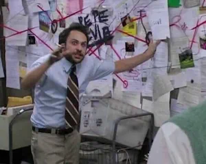
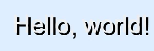
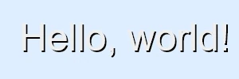
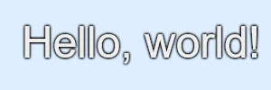
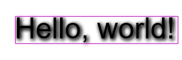

+++
title = "`text-shadow` and accessibility checking"
description = "How current accessibility checking tools support `text-shadow` when assessing contrast, and some ideas for improvement"
date = 2025-07-03

[taxonomies]
tags = ["web", "a11y"]

[extra]
comment = "versions: firefox 140.0.2, lighthouse 12.6.0"
+++

A minor annoyance thrown up by accessibility checking led, as minor annoyances do, to an extended look into how `text-shadow` affects legibility and how tools might take that into account. A basic Proof of Concept demo (not properly part of the blog, and necessarily includes script) implements some possible ideas for improvement.

At the time of writing, the top right of this blog's header showed the blog name in white letters overlaid on a background image including both landscape (dark-to-medium brightness) and sky (light). Since white-on-light isn't great for contrast, I'd added a text shadow effect providing a darker halo around the letters. I didn't think much more about it until I ran the accessibility checker built into Firefox's excellent developer tools, which delivered the damning verdict *"Does not meet WCAG standards for accessible text"*, with a best-case colour swatch strongly suggesting that the tool wasn't paying any attention at all to the shadow specifically intended to improve contrast. [Lighthouse](https://en.wikipedia.org/wiki/Lighthouse_\(software\)) (the corresponding tool in Chromium-based browsers) raised no such objection, but continued to raise no objection even without the shadow, which cast some doubts upon its rigour. Oh well, this was clearly just one of those trifling disappointments which build character and add texture to life's rich tapestry, and certainly nothing to warrant an obsessive overreac--



## Background

Accessibility checkers are tools designed to help developers make their UIs as usable as possible for people with various disabilities, including difficulties distinguishing differences in brightness and colour. The Firefox accessibility tool has a nifty "Simulate" tool where you can get a sense of what this looks like in practice; it can also run an audit of your page to try to catch some common issues, like the one that prompted this post. This was
WCAG's [Contrast (Minimum)](https://w3c.github.io/wcag/guidelines/22/#contrast-minimum) rule, which wants a contrast of at least 4.5:1 for normal text or 3:1 for large text.


That's very debateable; the text serves as a hyperlink to the blog's homepage, so it's not purely decorative. More to the point, there's no way to mark an element as "part of a logo or brand name", which makes the question kind of moot. 


The WCAG rule is notably vague on what's being contrasted with what. Normally it'll just be text colour against background colour, which is easy to validate, but there are also more complicated possibilities:

- The background is an image or gradient rather than a flat colour
- The text has a CSS [`text-shadow`](https://developer.mozilla.org/en-US/docs/Web/CSS/text-shadow) effect applied, often specifically to improve contrast
- The text has an outline in a different colour, drawn with the new and still vendor-prefixed but nevertheless widely-supported CSS [`-webkit-text-stroke`](https://developer.mozilla.org/en-US/docs/Web/CSS/-webkit-text-stroke) property
- The text is shown superimposed over some arbitrary other content, e.g. using `position: absolute` or just poorly-managed overflow

This post is mainly interested in the second of these, but they're all worth keeping in mind and will come up again. One complication I'm not going to cover here is partially-transparent text colour; mildly interesting, but it's straightforwardly bad for contrast and doesn't have a lot in common with our main focus. I'm also not considering the important caveat that layout shifts might move text onto a different background; as far as I know, all checkers only consider a snapshot and can't simulate possible changes to it.


CSS has a recent `@media` feature called [`prefers-contrast`](https://developer.mozilla.org/en-US/docs/Web/CSS/@media/prefers-contrast), which allows stylesheet authors to enable special rules for users who need more contrast. In the case of our header, we could do something like slapping a big black box under the link text:

```css
@media (prefers-contrast: more) { /* replace with no-preference to test */
    header a { 
        background-color: #000a; 
        border-radius: 0.5em; 
        box-shadow: 0 0 0.5em #000a; 
    }
}
```

With a rule like that in effect, checkers are happy. Unfortunately, in the normal course of things, checkers don't simulate this preference being enabled when assessing contrast. There's an argument to be made that they *should*, and there's a [Bugzilla ticket](https://bugzilla.mozilla.org/show_bug.cgi?id=1934406) you can follow if you agree. I'm ambivalent; the rationale makes sense, but I can also imagine cases where the user doesn't know about the preference, or is using someone else's computer where they don't feel comfortable messing with settings, or a browser running in kiosk mode where the settings aren't physically accessible.


## Perceptual considerations

The `text-shadow` property description is deceptively simple. There are only really three knobs to twiddle: the colour of the shadow, the offset of the shadow from the text generating it, and the blur radius (formally the size of the convolution matrix used by the effect's [Gaussian blur](https://en.wikipedia.org/wiki/Gaussian_blur); informally, how much the shadow is diffuse rather than hard-edged). There's also a fourth factor, which is that multiple shadows can be declared in the same CSS rule, potentially with different colour/offset/radius settings.

The interaction of these factors, though, makes the impact of shadows on legibility a non-trivial thing to model. Not [`font-size` levels of nontrivial](https://manishearth.github.io/blog/2017/08/10/font-size-an-unexpectedly-complex-css-property/) by any means, but nontrivial.

Colour is the simplest. Text shadows tend to be weak at best, so I'm not considering fractional alpha. However, don't assume that a shadow necessarily *helps* contrast. Some uses are more glows than shadows, matching or enhancing the text to make it appear brighter, but also effectively blurring its edges and making it less readable:

[](https://mrec.github.io/webtoys/masked_contrast/#!d4gnr)

Offset is technically two offsets, `x` and `y`. For shadows aiming to enhance contrast it'll usually make sense to offset on both axes; a vertical-only offset won't do much to enhance the legibility of a sans-serif 'I', or a horizontal-only one of an em dash. A zero offset in the absence of any blur means the shadow will be invisible behind its text, making it useless. Excessive offsets hurt legibility more than they help; in extreme cases they may not even be onscreen, but even slightly too high and they can start to separate shadows from their parent glyphs or overlap neigbouring glyphs.

[](https://mrec.github.io/webtoys/masked_contrast/#!d1exn)

Blur radius is the only optional part of the property, defaulting to zero. (This may just reflect the fact that Gaussian blurs are relatively expensive operations, not feasible on old or low-end hardware.) Small radii give a more tightly-defined shadow but may be so thin as to be imperceptible; with no offset, most of the glyph pixels covered by the blur kernel just end up contributing shadow to pixels hidden under the same glyph. Larger radii give a larger halo, but at the cost of diluting the shadow contribution and so providing weaker contrast.


[](https://mrec.github.io/webtoys/masked_contrast/#!d1ent)
[](https://mrec.github.io/webtoys/masked_contrast/#!d1enx)

Slightly surprisingly, a small offset on its own can be perceptually just as effective as a small blur on its own, despite only providing contrast along one side of a glyph. I think this is because it's a **stronger** contrast, with alpha undiluted by blurring, and because essentially all writing systems are fundamentally made up of lines. (Braille is the only major exception, and not relevant to a discussion of visual contrast.) Solid glyph shapes are just embellishments; it's less important to see all the edges of a shape faintly than to see all the core lines clearly. There are pitfalls here, though: any single offset direction is likely to leave some lines without contrast. For a typical diagonal offset, for example, half of 'x' is likely to suffer. And to be clear, this is not good contrast! It's just better than nothing, and ought to be recognized as such.

[](https://mrec.github.io/webtoys/masked_contrast/#!d1etn)

With both offset and blur combined, the sweet spot seems to be to have the centre of each shadow line, the most opaque part, displaced to the edge of its glyph line, while blur is just sufficient to provide some contrast to the other side of the stem without diluting the shadow too much.

[](https://mrec.github.io/webtoys/masked_contrast/#!d2etr)

The most common use of multiple shadows is to stack the same definition several times, to support a larger blur while still accumulating enough alpha to be effective. I'm assuming this for the sake of simplicity. Other more artistic patterns are possible, but rare. Lighthouse considers one interesting case, that of multiple thin (tiny offset, little or no blur) shadows stacked at slightly different offsets to approximate the effect of an outline stroke. This may have been common practice before blurs were widely supported, but these days a few clone shadows stacked with tiny blur and no offset can produce a similar but smoother effect, or the new `-webkit-text-stroke` can support the desired text stroke directly.

[](https://mrec.github.io/webtoys/masked_contrast/#!d4ens)


The ubiquity of multiple stacked copies as the solution to overly watery `text-shadow`s has become something of a pet peeve over the course of looking into this topic. As mentioned before, a Gaussian blur is *expensive*, and multiple identical blurs multiply that expense. It would seem to make far more sense to support a simple saturating alpha multiplier that could achieve the same result with only a single blur and a fraction of the cost.

This is something that a Sufficiently Smart Browser could theoretically optimize behind the scenes, but I don't know if any do. And the intent of an explicit multiplier would be far clearer in the CSS than reading a half-dozen shadow definitions and checking that they're all the same.


So if those are some of the major considerations, how might we deal with them? There are two main paths: the analytic approach, which only looks at the styled DOM tree, and the image-based approach, which looks at the actual pixels getting rendered. Both Firefox and Lighthouse do the former in simple cases, with Lighthouse taking it further in the specific `text-shadow` case. To the best of my knowledge, only Firefox does image-based assessment; I'm not sure that Lighthouse's architecture would even allow it to, since it's less tightly coupled with the browser.

## Lighthouse and the analytic approach

When I first noticed that Lighthouse didn't object to my header, I decided that it was a splendid tool. When I subsequently found that Lighthouse just gives up on assessing any element with a `background-image`, I decided that it was a terrible tool. When I found out even later that without a `background-image` Lighthouse goes to considerable lengths to account for `text-shadow`, I decided that maybe I have an unhealthy habit of jumping to conclusions.

Lighthouse considers the presence of a shadow, its colour, blur radius and offset. I don't necessarily agree with all its choices, but it's a serious effort with a lot of thought behind it. If you want to dig into the implementation, most of it is in [`axe-core`'s `get-text-shadow-colors.js`](https://github.com/dequelabs/axe-core/blob/develop/lib/commons/color/get-text-shadow-colors.js) under the MPL 2.0 license.


For some reason, when foreground and background colours are exactly the same, Lighthouse reports that accessibility is absolutely fine. This is regardless of any shadow. At first I thought it was hitting some sort of divide-by-zero internally and falling over, but it might also be a deliberate rule to handle an old webdev pattern which used this trick to hide content from most users while still showing it to screen readers.

Either way, it's a little disconcerting. It's the sort of mistake that could genuinely happen if you were converting a light-mode stylesheet to dark mode and missed something. It can also give you misleading ideas about Lighthouse's analysis; the white foreground/background, black shadow combination was an obvious experiment to try when testing its shadow handling.


I was curious to see where starting from first principles would get me, and eventually boiled the perceptual considerations listed earlier down into two main factors: **exposure** and **dilution**.

**Exposure** estimates how much of a shadow ends up somewhere useful; neither hidden under a glyph nor too far away from it to be effective. Exposure can be increased up to a point by either offset (moving the shadow out from under), blur (spreading the shadow out from under) or a combination of the two. In both cases the sweet spot is largely driven by the font's stem width, the thickness of each stroke making up a glyph. This isn't something that font metrics expose, so I'm estimating it to be roughly a tenth of the font size; the real number will vary by resolved `font-family` and in a serious implementation should be adjusted for `font-weight`. From experimentation, going over the sweet spot hurt legibility more than being under it, so exposure calculations use an opinionated helper function that applies exponential penalties over the ideal level:

```js
function opinionatedExposure(stemWidth, raw, ideal, excessExponent) {
    let norm = raw / stemWidth;
    let exposure = norm / ideal;
    if (exposure > 1) exposure /= (exposure ** excessExponent);
    return exposure;
}
```

**Dilution** estimates how much a shadow's opacity is reduced by blur. This turned out to be a nasty, nasty problem. A simple closed-form equation based on radius penalizes large blurs too much; perceptually, we're mostly interested in the peak opacity at a glyph edge. Lower opacity further out might not help, but it doesn't actively hurt. A weighted 1D Gaussian approximation dramatically underestimates opacity, because the shadow blur we're doing is 2D, meaning far more input pixels contribute to the output, in glyph-area-dependent ways. Looking at 2D Gaussians led me to things like Abramowitz and Stegun's fast erf approximation, which is so far outside my mathematically-challenged comfort zone that I couldn't see my mathematically-challenged sofa with a telescope. 

At this point I stepped back, took some empirical measurements of edge shadow opacity for a 48px font at various blurs, and got ChatGPT to fit them to a curve for me. I'm not proud, but I am tired. (Lighthouse does the same kind of thing, which makes me feel a bit better.)

```js
function fittedAlpha(blur) {
    return 1 / (1 + 9.035 * (blur / fontSize) ** 2);
}
```

With both exposure and dilution in hand, we can put everything together. This is cut down from the [webtoy source](https://github.com/mrec/webtoys/blob/main/masked_contrast/index.html#L223), with verbose commenting stripped out:

```js
// bgLum & fgLum are luminance values in the range 0..=1, stack is the number of shadow clones
// luminance and contrast functions follow the https://www.w3.org/TR/WCAG21/ formulae
const baseContrast = contrast(bgLum, fgLum);
const offset = Math.max(Math.abs(x), Math.abs(y));
const offsetExposure = opinionatedExposure(stemWidth, offset, 0.6, 4);
const blurExposure = opinionatedExposure(stemWidth, blur, 1.4, 1.5);
const combinedExposure 
    = (0.2 * offsetExposure) 
    + (0.7 * blurExposure) 
    + (0.1 * offsetExposure * blurExposure);
const dilutedAlpha = fittedAlpha(blur);
const bgShineThrough = (1 - dilutedAlpha) ** stack;
const shadowedBgLum = shadowLum * (1 - bgShineThrough) + bgLum * bgShineThrough;
const idealContrast = contrast(fgLum, shadowedBgLum);
const finalContrast = idealContrast * combinedExposure + baseContrast * (1 - combinedExposure);
```

Which in turn produces an analytic report with concrete numbers like [this](https://mrec.github.io/webtoys/masked_contrast/#!d2etr):

```
background colour: rgb(221, 238, 255)
  luminance: 0.84
text colour: rgb(238, 238, 238)
  luminance: 0.85
text/background contrast: 1.02
shadow: rgb(0, 0, 0) 2px 2px 7px
  stack: x2
  base luminance: 0.00
  exposure:
    offset: 0.69
    blur: 0.98
    combined: 0.89
  dilutedAlpha (per shadow): 0.84
  dilutedAlpha (cumulative): 0.97
  shadowed background luminance: 0.02
  ideal shadow contrast: 12.61
final exposure-adjusted contrast: 11.37
```

So: is this approach viable? Up to a point, yes. It's obviously extremely opinionated, and I don't claim for a moment that any particular formula or tuning constant is the best one. But the exposure/dilution framing seemed to help keep things manageable, and the output numbers do generally move in the right direction when twiddling shadow settings. For simple shadows and simple backgrounds it's fine.

However, it's a very incomplete tool. It would need extension and testing for different fonts, sizes, weights, and multiple shadows that aren't just clones of each other. It doesn't (and can't) take complex backgrounds into account, and this isn't some weird edge case: one of the prime uses of `text-shadow` is to ensure contrast against unknown backgrounds. It would be utterly unfair to expect it to understand and predict the effect of something like an arbitrary [SVG filter](https://developer.mozilla.org/en-US/docs/Web/SVG/Reference/Element/filter) applied via a [CSS filter](https://developer.mozilla.org/en-US/docs/Web/CSS/filter), a much more powerful and flexible tool for effects like this. For a more robust and general solution, we'd need to turn to image-based approaches.

## Firefox and the image-based approach

Unlike Lighthouse, Firefox's accessibility checker does cope with text over a background image. It hides the text, renders the layout box the text would fill, grabs the background pixels in that box, finds the lightest and darkest of those pixels and assesses contrast with whichever of those is worse for the text colour. This is ambitious, flexible and praiseworthy. Unfortunately it doesn't work for `text-shadow`. To fix that, three hurdles would need to be cleared.

First hurdle: Firefox doesn't *see* the shadow. It hides the text (I think) by temporarily setting `visibility: hidden` on it, making it invisible without disturbing layout. However, when you do this, the text shadow doesn't get drawn either, and we really wanted that to be part of the background capture. This one looks relatively easy to resolve. If instead of `visibility: hidden` we give the text a colour with an alpha component of zero, it'll still be invisible, but the shadow does get drawn since it's drawn using the shadow colour, not the text colour. You can confirm this via the DOM inspector.


I'd have thought that in this case Firefox would fall back to an analytic approach, especially since coming across various references to it using at least parts of `axe-core`, the accessibility engine behind Lighthouse. But either it doesn't, or that analysis doesn't look at `text-shadow` either. With white foreground/background, black shadow and no `background-image`, Firefox only reports a white background.


Second hurdle: background pixel sampling looks at too many pixels. This cuts both ways. Most obviously, it looks at pixels in the text's layout box but not covered by a shadow hugging the glyph edges; this would make it unduly pessimistic about contrast. Less obviously, it  looks at shadow pixels which are nice and opaque but are also entirely covered by the glyph; this could make it unduly optimistic about contrast. 

If what matters for legibility is the fairly narrow band of pixels around each glyph, it would be nice to only consider those. We want an outline mask, and happily we can build one using an SVG dilation filter. Take the text's alpha channel, threshold it to 0/1 to avoid nasty fringe effects from antialiasing, dilate it to grow outwards by our desired outline mask thickness, knock out the original text mask, and paint it something distinctive. Render text with our filter to an offscreen canvas, grab the pixels and convert it to an alpha mask.

```xml
<filter id="dilate" x="-10%" y="-10%" width="120%" height="120%">
    <feComponentTransfer in="SourceAlpha" result="alpha">
        <feFuncA type="discrete" tableValues="0 1"/>
    </feComponentTransfer>
    <feMorphology in="alpha" operator="dilate" radius="${maskWidth}" result="dilated"/>
    <feComposite in="dilated" in2="alpha" operator="out" result="border"/>
    <feFlood flood-color="fuchsia" result="flood"/>
    <feComposite in="flood" in2="border" operator="in"/>
</filter>
```

Now when we grab our background pixels, we can check whether the corresponding pixel in the mask is set, and skip pixels that aren't covered. The difference between "all pixels in the layout box" and "only pixels covered by the outline mask" is dramatic.

[](https://mrec.github.io/webtoys/masked_contrast/#!c2vtr)
[](https://mrec.github.io/webtoys/masked_contrast/#!c2vtr)





## TODO

- Possibly sidenotes on -webkit-text-stroke and how that needs a different approach (probably check contrast with the stroke colour rather than the fill).
- text-shadow and accessibility contrast checking
	- would an edge detection filter be useful?
			"what % of dilate-mask pixels show a strong edge?"
			does this actually offer any benefit over looking at average contrast?
	- how to combine ts-contrast with bg-contrast? best of? worst of? something else?
	- assess a (weighted?) average contrast rather than just taking the worst case?
	- https://www.w3.org/TR/WCAG21/#dfn-contrast-ratio note 5 is very interesting
	- why impl might be easier with browser chrome privileges
- radius is not really a hard pixel limit, in either CSS or canvas

Don't forget to put webtoys live and check links before publishing!

Don't forget to describe and caveat the webtoy

In webtoy, warn that Safari doesn't support CanvasRenderingContext2D: filter
    new OffscreenCanvas(10,10).getContext("2d").filter  == undefined
